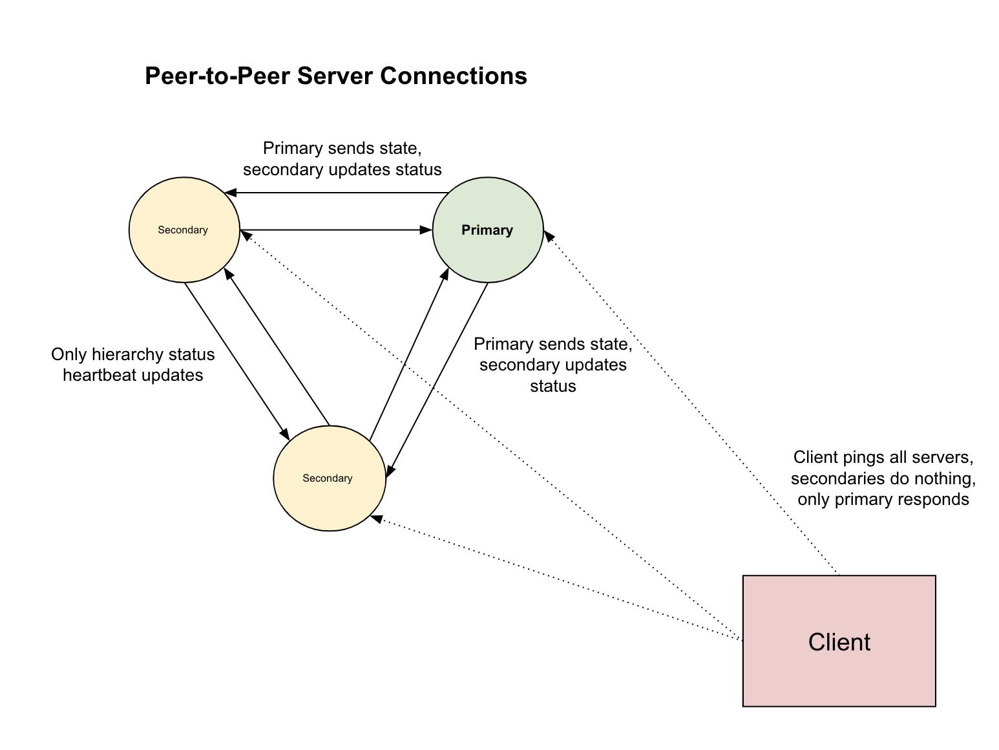
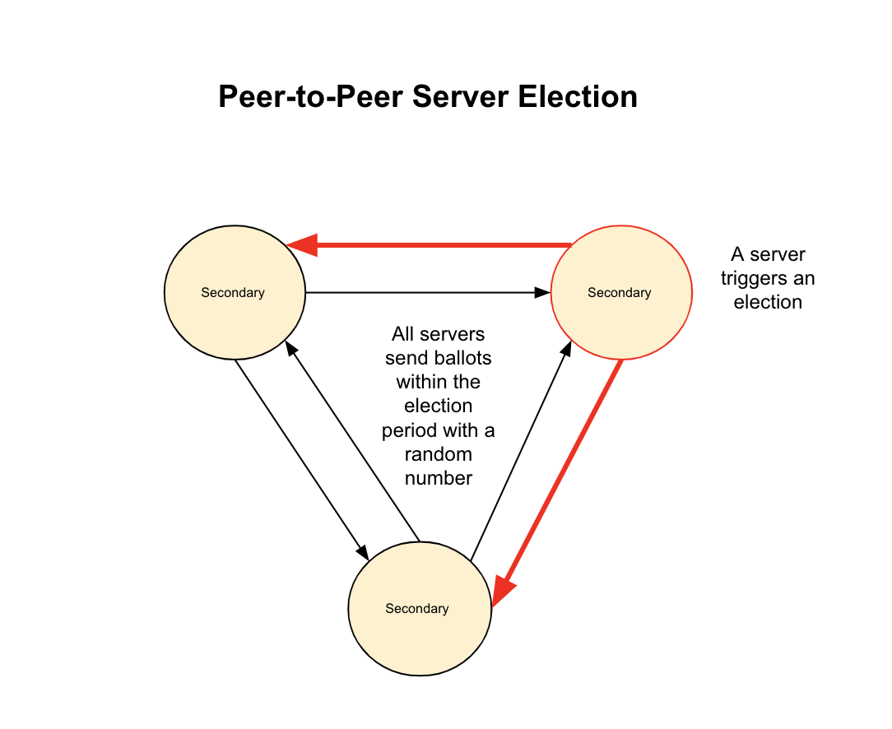

# Design Documentation - Table of Contents

This document contains links to all of our relevant design documentation.

## (1) Server Communication and Consensus Shim

Our new code defines a function serve that sets up a gRPC server and starts a thread for inter-server communication. The inter-server communication thread is responsible for coordinating between multiple instances of the gRPC server.

The inter_server_communication_thread function first initializes a listening interface by creating a new thread init_thread and calling the init_listening_interface function. It then waits for some time (INITIALIZE_WAIT_TIME) to allow the server-side logic to initialize on all processes.

Next, it iterates over all internal server addresses (INTERNAL_SERVER_ADDRS) and connects to each one except the current one (based on the port). For each connection, it creates a socket object and stores it in a dictionary (self.sockets_dict) along with metadata about the server (self.replica_metadata).

The function then enters a loop that runs indefinitely, pausing for a certain amount of time (REFRESH_TIME) on each iteration. During each iteration, it sends a message to each connected server with an update on the current server's status. It also checks the metadata of each connected server to see if it has a primary server. If no primary server is found after a certain number of iterations (ELECTION_ITERS), it triggers an election process by calling the TriggerElection function. If an election is already in progress (self.election_time is True), it calls the GetElectionWinner function to determine the winner of the election.

The SubmitBallot function is responsible for submitting a ballot to each connected server during an election process. It generates a random election value and adds it to the ballot box along with the server's port and timestamp. It then sends a message to each connected server with the election value.

The TriggerElection function is responsible for triggering an election process. It clears the ballot box and sends a message to each connected server indicating that an election has been triggered.

The GetElectionWinner function waits for a certain amount of time (8*ELECTION_CHECK_TIME) after an election has been triggered and then determines the winner based on the highest election value and lowest timestamp. If the current server is the winner, it updates its status to ServerState.PRIMARY.

Everytime the state changes on the primary server, it updates the secondary servers by sending a package of the current server state and write to the log file for persistency. When the server finishes writing to the log file, a commit entry is added for the specific log hash to represent a completed operation. This helps in the case that the server goes down during a write to the log file.

When the server boots up again, we read from the last commit made by the server for each server. Then in a consenus period, the servers decide to accept the state of the most recent time-stamped copy. That copy is shared with all of the servers which then go into an election cycle soon after start-up. 

## (2) gRPC and Wire Protocol Message and Protocol Structure

### Overview

This documentation describes the design of the wire protocol and gRPC implementation for a chat server. The wire protocol encoding scheme uses an opcode and version number to determine the type of operation and support backwards compatibility. The message is encoded as a unified string buffer and decoded by parsing deliminated fields. An authentication token is required for every operation that requires the user to be logged in, which is validated by the server-side token hub upon receiving a message. The documentation also provides the message types for create account, login, message request, and list account functionalities in both wire protocol and gRPC implementation, with slight variations between the two. The documentation provides the code structure for both the wire protocol and gRPC implementation for each message type.

[Full Wire Protocol and gRPC Documentation Here](wire_design.md)

## (3) Locking Structure and Hierarchy

### Overview

The "Locking Overview" documentation outlines the access protection mechanism of a chat server for server-wide user metadata. Three structures require access protection: user metadata store, token hub, and user inbox. The user metadata store and token hub use the `app.metadata_lock`, while the user inbox has its own lock called `app.inbox_lock`. The locking is implemented using the with pythonic syntax to ensure that the lock is not held after a function returns or a scope is unexpectedly terminated. The locking hierarchy is strictly maintained to prevent deadlocks, where the metadata lock is held first, followed by the inbox lock, and the reverse order is used to release them. Overall, the fine-grained locking approach aims to reduce contention and increase efficiency in handling concurrent requests in the chat server.

[Full Locking Documentation Here](locking_design.md)

## (4) Multi-threading Server / Client Structure

### Overview

For the gRPC setup, we have a global pool of threads that we can use to handle incomimg connections for each request. We use a RPC stream response for a client's refresh thread. This returns a blocking iterator object that in turn takes the messages that the user has not gotten and forwards them to the user. On the other hand, we have the socket implementation that does not run as a dameon thread because it is essentially polling the inbox server with a timed loop that constantly asks for refreshed messages in return for a message update per refresh. 

[Full Design Schematic](schematic.md)

## (5) Testing Framework

### Overview

The code contains unit tests for chat server functionalities such as token generation, account creation, token verification, login, and message sending. The test suite also includes tests for account listing and deletion. Integration tests for concurrent message sending and receiving using multiple threads are also conducted. The integration tests check whether the application is able to create an account and login successfully, list the created account, send a message to another client application, and concurrently listen for incoming messages from other clients. If the integration tests pass, the function returns an integer value of 0, otherwise, an assertion error is raised, which stops the program. The server side communication tests for replication, double fault support functions and persistency. 

[Full Testing Details](testing.md)

