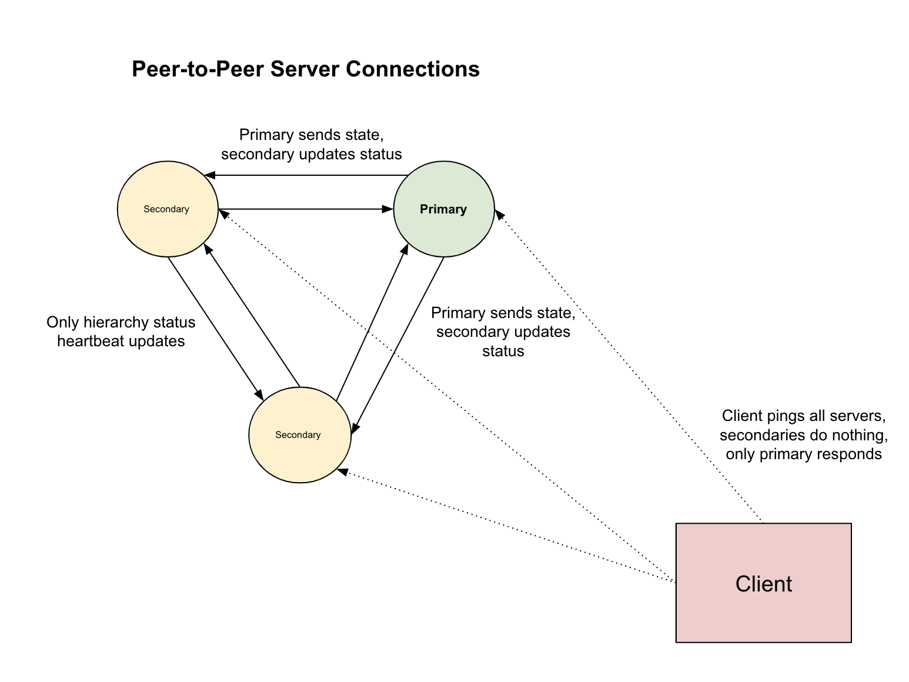

# Current Project Entries

## Entry 4/2/2023 7:50 pm

Added base code for server communication between internal server nodes. We added a class that supports a thread purely dedicated to server to server communication that is set up similar to the logicial clocks peer-to-peer communication. 

## Entry 4/2/2023 10:30 pm

We realized that we could get the server to work but we do not want to have the internal server traffic be shared along the same ports as the the client side traffic and so we tested out having both internal ports for the other replicas and external ports for the client side connections.

We next worked on adding logic for elections between nodes to decide who is the primary. We basically decided that each node would generate its own random value and then report that random value as a ballot. The winner would be the one with the highest value in their ballot and ties would be broken by timestamp. In the case a second election is triggered, or another orimary is designated due to failure, a reset election can take place.

## Entry 4/3/2023 5:00 pm

We found bugs with the previous code in implementing the election logic when we combined it with the persistent state logic because the key errors in our replica metadata object was not being secured by locking and we were not preventing null write to metadata from failed server threads. This would cause issues with the server side election logic and that would in turn lead to silent failures which would cause unexpected behavior. 

## Entry 4/7/2023 11:00 pm

We added code on the client side for our gRPC server such that the client will redundantly message all replicas but only the primary will do anything with the client's message and the secondaries will only observe. We also changed the state update code so that ony primary is sending out their status updates to the other replica nodes. We had an issue with loading state with incomplete writes so we added a commit log which marks the end of writing a file for a full inbox save update. We then use the last known commit and use that the sync the remaining servers upon start up. 

## Entry 4/8/2023 2:30 pm
We encountered an issue with data consistency among replicas. Upon analyzing the code, we found that it was due to the fact that we did not have a strong consistency mechanism in place. We realized that we needed to implement a replication protocol that could ensure consistency of data across all the replicas. After researching, we decided to use the primary-backup protocol where the primary replica receives all the updates and forwards them to the backup replicas. We implemented this protocol and tested it, and it seems to work as expected.

## Entry 4/9/2023 6:45 pm
We added a feature for fault tolerance where if the primary replica fails, the next replica with the highest priority will take over as the primary. We also implemented a heartbeat mechanism to detect if a replica is alive or dead. In case a replica fails, we added a timeout mechanism where the other replicas would wait for a certain period of time before deciding to declare it as dead and initiate an election process. We tested this feature by deliberately stopping a replica and observed that the other replicas were able to detect the failure and continue to operate as expected.

## Entry 4/10/2023 4:30 pm
We added support for persistent storage of chat messages, so that if a server crashes, it can recover its state from the storage. We implemented a simple csv file storage, and added logic to write all incoming messages to the storage. We also added a mechanism to periodically flush the database to disk to ensure that data is not lost in case of a server failure. We tested the recovery mechanism by deliberately crashing a server, and observed that it was able to recover its state from the file storage and continue operation as expected.

## Entry 4/9/2023 12:00 pm 

Added the following unit tests:

`class TestServerInterface(unittest.TestCase):` A test class named TestServerInterface is defined, which inherits from unittest.TestCase. This allows the class to use the unittest framework for running test cases.

def setUp(self):: The setUp method is called before each test case. It sets up a mock ChatServer object and initializes a ServerInterface object with the mocked ChatServer and a test port. This is done to ensure that each test case starts with a clean and predictable state.

`def test_init_listening_interface(self):` This test case checks if the init_listening_interface method creates a socket, binds it to the correct port, and starts listening. It uses socket.socketpair() to create a pair of connected sockets to simulate a client-server connection, and replaces the init_listening_interface method with a MagicMock that returns the server-side socket. It then checks if the server-side socket is bound to the correct port and is listening.

`def test_submit_ballot(self):` This test case checks if the SubmitBallot method adds an entry for the current server in the ballot_box. It clears the sockets_dict to prevent sending messages and calls the SubmitBallot method. It then checks if the current server's port is in the ballot_box.

`def test_trigger_election(self):` This test case checks if the TriggerElection method sets election_time to False and clears the ballot_box. It clears the sockets_dict to prevent sending messages and calls the TriggerElection method. It then checks if election_time is False and the ballot_box is empty.

`def test_get_election_winner(self):` This test case checks if the GetElectionWinner method sets election_time to False and updates the server_state for the winning server. It creates a sample ballot_box and sets election_time to True. The time.sleep function is mocked to avoid waiting during the test execution. It then calls the GetElectionWinner method and checks if election_time is False, and the server_state is PRIMARY for the winning server.

## Entry 4/9/2023 10:00 pm

Added the following design documentation:

Our new code defines a function serve that sets up a gRPC server and starts a thread for inter-server communication. The inter-server communication thread is responsible for coordinating between multiple instances of the gRPC server.

The inter_server_communication_thread function first initializes a listening interface by creating a new thread init_thread and calling the init_listening_interface function. It then waits for some time (INITIALIZE_WAIT_TIME) to allow the server-side logic to initialize on all processes.

Next, it iterates over all internal server addresses (INTERNAL_SERVER_ADDRS) and connects to each one except the current one (based on the port). For each connection, it creates a socket object and stores it in a dictionary (self.sockets_dict) along with metadata about the server (self.replica_metadata).



The function then enters a loop that runs indefinitely, pausing for a certain amount of time (REFRESH_TIME) on each iteration. During each iteration, it sends a message to each connected server with an update on the current server's status. It also checks the metadata of each connected server to see if it has a primary server. If no primary server is found after a certain number of iterations (ELECTION_ITERS), it triggers an election process by calling the TriggerElection function. If an election is already in progress (self.election_time is True), it calls the GetElectionWinner function to determine the winner of the election.

The SubmitBallot function is responsible for submitting a ballot to each connected server during an election process. It generates a random election value and adds it to the ballot box along with the server's port and timestamp. It then sends a message to each connected server with the election value.

The TriggerElection function is responsible for triggering an election process. It clears the ballot box and sends a message to each connected server indicating that an election has been triggered.

The GetElectionWinner function waits for a certain amount of time (8*ELECTION_CHECK_TIME) after an election has been triggered and then determines the winner based on the highest election value and lowest timestamp. If the current server is the winner, it updates its status to ServerState.PRIMARY.


Everytime the state changes on the primary server, it updates the secondary servers by sending a package of the current server state and write to the log file for persistency. When the server finishes writing to the log file, a commit entry is added for the specific log hash to represent a completed operation. This helps in the case that the server goes down during a write to the log file.

When the server boots up again, we read from the last commit made by the server for each server. Then in a consenus period, the servers decide to accept the state of the most recent time-stamped copy. That copy is shared with all of the servers which then go into an election cycle soon after start-up. 

# Previous Project Entries


## Entry 2/9/2023 11:00 am

Worked on looking at documentation of the the python GrPC protocol online and worked through the demo example provided regarding latitude and longitude coordinate transfer. 
Talked about how we do not have to stream things messages, because each message can be treated as its own operation rather than a streaming operation.

We then used the HelloWorld proto base template to get started with our application. We notice that routines are delineated with the rpc function and respective service declaration. Meanwhile the types that the services use are declared under the message declaration. 

We can recreate the stub files using the proto: 

`python -m grpc_tools.protoc -I protos --python_out=. --pyi_out=. --grpc_python_out=. protos/chat.proto`

We now see that it is good form to have the protos file inside of a protos directory. 

## Entry 2/9/2023 9:04 pm 

In order to create an account, we have a username Unique Id, Name, password. To send messages the user has to login. We want to avoid a situation where two people request to make a username account and both will not be assigned the same id (whoever's request is sent first). My basic take is that the login token recieved should just expire after an hour and not take user activity into account. I (AM) would prefer if we implement most basic working implementation first before adding bells and whistles. 

50 characters max for every field. You can see at max 100 users. 100*50 characters passed in the list accounts operation. Regex matching for search to query relevant names. 

We have to mantain a list of the tokens that are valid, deliver to chat user either right away, or as they login. As the user logs in, we have to return a message stream. In regards, to deleting an account and generally - you have to be logged in order to to any operation such as deleting an account. Seeing that the user has to be logged in order to delete an account, they will recieve all of their undelivereed messages first. 

For the future, we want to mantain message histories, delivery confirmation and auth extension based on activity. For now we are starting with individual messages to get the server to work in the future we might add message streams.  

## Entry 2/10/2023 5:19 pm

We finalized our wire protocol standards as follows: The wire protocol encoding scheme uses an opcode and version number to determine the type of operation and support backwards compatibility. The message is encoded as a unified string buffer and decoded by parsing deliminated fields. An authentication token is required for every operation that requires the user to be logged in, which is validated by the server-side token hub upon receiving a message. The documentation also provides the message types for create account, login, message request, and list account functionalities in both wire protocol and gRPC implementation, with slight variations between the two. The documentation provides the code structure for both the wire protocol and gRPC implementation for each message type.

[Full Wire Protocol and gRPC Documentation Here](wire_design.md)


## Entry 2/12/2023 4:37 pm 

In order to create a user account we have to keep track of metadata. We opt for the twitter type inbox system where messages are just queues waiting for the user like emails. We also enable a user metadata store that keeps track of all usernames, passwords and full names. Lastly, we have a token hub which in turn provides the much needed token to timestamp mapping so we can tell when a token has expired. 


## Entry 2/13/2023 9:13 am


We ran into the following error when trying to use a forked process for the tkinter interface and the listening thread and then realized that we could not do this because the main loop object was not serializable. This came at the cost of us using python threads for the listening loop insteads of processes from Multiprocessing. 

```
Traceback (most recent call last):
  File "/Users/amishra/cs262-wire-protocol/client.py", line 184, in <module>
    run()
  File "/Users/amishra/cs262-wire-protocol/client.py", line 180, in run
    app.start()
  File "/Users/amishra/cs262-wire-protocol/client.py", line 70, in start
    mp.Process(target=self.listen_loop, daemon=True).start()
  File "/Users/amishra/miniconda3/envs/262-dev/lib/python3.9/multiprocessing/process.py", line 121, in start
    self._popen = self._Popen(self)
  File "/Users/amishra/miniconda3/envs/262-dev/lib/python3.9/multiprocessing/context.py", line 224, in _Popen
    return _default_context.get_context().Process._Popen(process_obj)
  File "/Users/amishra/miniconda3/envs/262-dev/lib/python3.9/multiprocessing/context.py", line 284, in _Popen
    return Popen(process_obj)
  File "/Users/amishra/miniconda3/envs/262-dev/lib/python3.9/multiprocessing/popen_spawn_posix.py", line 32, in __init__
    super().__init__(process_obj)
  File "/Users/amishra/miniconda3/envs/262-dev/lib/python3.9/multiprocessing/popen_fork.py", line 19, in __init__
    self._launch(process_obj)
  File "/Users/amishra/miniconda3/envs/262-dev/lib/python3.9/multiprocessing/popen_spawn_posix.py", line 47, in _launch
    reduction.dump(process_obj, fp)
  File "/Users/amishra/miniconda3/envs/262-dev/lib/python3.9/multiprocessing/reduction.py", line 60, in dump
    ForkingPickler(file, protocol).dump(obj)
TypeError: cannot pickle '_tkinter.tkapp' object
```


## Entry 2/13/2023 10:32 pm 

We ran into this error when we found the tokens we were using in token hub had the incorrect datetime formatting and indexing issue. We fixed this by standardizing to UTC. 

```
Exception in thread Thread-1:
Traceback (most recent call last):
  File "/Users/amishra/miniconda3/envs/262-dev/lib/python3.9/threading.py", line 980, in _bootstrap_inner
    self.run()
  File "/Users/amishra/miniconda3/envs/262-dev/lib/python3.9/threading.py", line 917, in run
    self._target(*self._args, **self._kwargs)
  File "/Users/amishra/cs262-wire-protocol/client.py", line 80, in listen_loop
    for note in self.client_stub.DeliverMessages(auth_msg_request):
  File "/Users/amishra/miniconda3/envs/262-dev/lib/python3.9/site-packages/grpc/_channel.py", line 426, in __next__
    return self._next()
  File "/Users/amishra/miniconda3/envs/262-dev/lib/python3.9/site-packages/grpc/_channel.py", line 826, in _next
    raise self
grpc._channel._MultiThreadedRendezvous: <_MultiThreadedRendezvous of RPC that terminated with:
        status = StatusCode.UNKNOWN
        details = "Exception iterating responses: 'float' object has no attribute 'total_seconds'"
        debug_error_string = "UNKNOWN:Error received from peer ipv6:%5B::1%5D:50051 {created_time:"2023-02-13T02:18:43.129338-05:00", grpc_status:2, grpc_message:"Exception iterating responses: \'float\' object has no attribute \'total_seconds\'"}"
```

## Entry 2/14/2023 4:13 pm 

We ran into several bugs with our integration testing due to deadlocks and contentions with our locking and integrity implementation. In order to solve this we removed any global locking and kept only some per object locks that have low contention. We found that three structures require access protection: user metadata store, token hub, and user inbox. The user metadata store and token hub use the `app.metadata_lock`, while the user inbox has its own lock called `app.inbox_lock`. The locking is implemented using the with pythonic syntax to ensure that the lock is not held after a function returns or a scope is unexpectedly terminated. The locking hierarchy is strictly maintained to prevent deadlocks, where the metadata lock is held first, followed by the inbox lock, and the reverse order is used to release them. Overall, the fine-grained locking approach aims to reduce contention and increase efficiency in handling concurrent requests in the chat server.

[Full Locking Documentation Here](locking_design.md)


## Entry 2/16/2023 12:00 pm

Todos: 
  - Handle GRPC errors on both client and server side
    - Check error codes on client side + show on the UI
    - Ensure no casting errors + crashing opportunities on server side
  - Integrate socket server and socket client into existing stack
    - Client disconnection should not crash server
      - Possible solutions: Timeout errors, look at the last TCP data sent
        on this connection
  - Logic for decoding
    - Client-side wire protocol
    - 4 bytes -> opcode (which dataclass the rest of this message refers to)
    - Client should ignore message if not decodable

## Entry 2/17/2023 3:30 pm 

We finished deciding on how we would implement the sockets part of the server code now that we have the grpc part done. This required us to settle for how capable our sockets server could be and we have simplified our overall design.For the gRPC setup, we have a global pool of threads that we can use to handle incomimg connections for each request. We use a RPC stream response for a client's refresh thread. This returns a blocking iterator object that in turn takes the messages that the user has not gotten and forwards them to the user. On the other hand, we have the socket implementation that does not run as a dameon thread because it is essentially polling the inbox server with a timed loop that constantly asks for refreshed messages in return for a message update per refresh. 

[Full Design Schematic](schematic.md) 

## Entry 2/18/2023 12:00 pm
For sockets, interesting problem of how we want to deal with clients violently disconnecting (by this, meaning disconnecting with no trace). We can either be constantly sending small messages back and forth between server and client once a connection is opened, and as soon as those stop being sent / received (with small timeout), we can end the connection on the server side. Or, we can have not send back and forths and instead just have a larger timeout (~60 min), such that as soon as the timeout is violated, we assume the client has "violently" disconnected and we end the connection. A 60 minute large timeout also corresponds to the liveliness of user auth tokens, although it has the con of leaving a connection open potentialsy long after it has been dead on the client side and also cutting a connection that is actually still open. It's unclear which implementation we should be using, but currently we will go with the large timeout option due to its ease of implementation.

## Entry 2/18/2023 6:00 pm
It seems like grpc automatically takes care of pairing. If two threads from the same machine each make a request, grpc will pair them correctly. I'm curious if we need to deal with the pairing in sockets. My intuition tells me no, since it seems like quite an annoying, nontrivial problem, and instead each thread / connection is given a unique port and receives a unique message.

## Entry 2/19/2023 11:00 pm
Found a bug in the UI that messages sent to an invalid recipient (aka a nonexistent username) still show up on the UI as if they were sent. We need a different message
to pop up on the UI indicating that user does not exist. Currently this bug has been verified to exist for both gRPC and socket implementations. I (RM) will fix this, 
but we will need to check to make sure the error handling is properly taken care of on the client everywhere else. We also need to potentially check the client that 
it can handle malicious messages sent to it.

It looks like only the CreateClientAccount code in the socket server was prepped to handle malicious messages, I forgot to add that to the rest of the messages. Perhaps we should be unit testing this behavior? Either way the code should be fixed now, malicious messages sent to the socket server should return an error code.

I found out that when the listening thread is not cleaned up properly then the waiting messages are not properly recieved either. 

## Entry 2/19/2023 11:30 pm

Caught a bug that allowed the socket based server to crach because the connection error was not handled well and the handler failed due to reset. We also caught a bug with concurrent accesses on deletion. Lastly, we were able to solve a couple of UI bugs that plagued our system.

We were able to solve these with our new testing framework. Our new code contains unit tests for chat server functionalities such as token generation, account creation, token verification, login, and message sending. The test suite also includes tests for account listing and deletion. Integration tests for concurrent message sending and receiving using multiple threads are also conducted. The integration tests check whether the application is able to create an account and login successfully, list the created account, send a message to another client application, and concurrently listen for incoming messages from other clients. If the integration tests pass, the function returns an integer value of 0, otherwise, an assertion error is raised, which stops the program.

[Full Testing Details](testing.md)

## Reflections on gRPC versus Wire Protocol

**Code Complexity.** The code that we wrote for the gRPC in order to get it to work was much more simplistic. Having the ability to instantly generate the stub code for serializing messages and decoding them is extremely useful. For the wire protocol, the act of packing the string buffer (or in C some memory buffer) is much more difficult. Having a struct object intialized before hand made the gRPC code more simple. Moreover, handling of where packets should go, how they should be handled and which function handles them is all taken care of. That is why we did not have to do manual connection management with sockets and manualy operation code assignment. This advantage of gRPC also contributed to simplifying our implementation as compared to the wire protocol. 

**Performance.** The ability to use streams with gRPC is super useful because the thread can then block for future messages that are sent whereas the socket implementation is left with polling. Mulitple polling refresh attempts makes the socket based wire protocol server, that we designed, unsustainable for future scaling. However, with gRPC we have the advantage of not having to use polling and the user inbox can be emptied right away as a client connects. Although we implemented a majority of this code in python, gRPC is also optimized for C buffers and the library also supports compression which can lower latency as well. In our wire-protocol, simply sending out strings is not doable in the long term. Additionally our manually encoding and decoding has lower performance as compared to protobuf's direct binary mapping. This also makes for way more efficient parsing than strings. Additionally, gRPC can handle multiple parallel requests over the same channel.

**Buffer Size.** When I compared the difference between the buffer size of the gRPC implementation and the wire protocol implementation, I found that there was a slight descrepancy. Using `ByteSize()` and `len()` for the wire protocol byte object the difference was made up for by the extra deliminating character in our buffer and the opcode assignment which made the difference of 4 bytes (100 bytes vs. 104 bytes) between the wire message and gRPC buffer size for the message "how are you doing? I hope you are well?". However, for the actual connection on the socket I send a buffer of 1024 each time and it does not fluctuate like the gRPC connection might. Therefore, the actual data that is transmitted is probably much lower for gRPC due to dynamic binary framing. Additionally another difference in the buffer size comes from the use of numbers for addressing fields rather than string field names. 